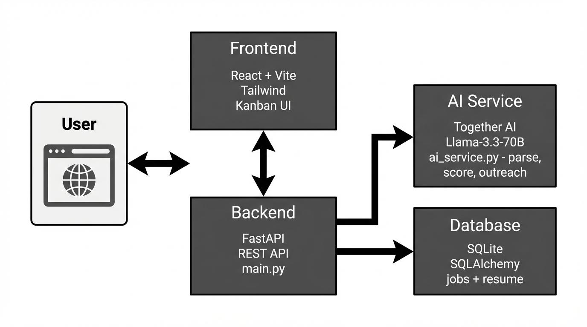

# GreenGPT Solutions — Mini-Project Documentation

**ApplyTracker**

*To use in Google Docs: In Google Drive, go to File → Open → Upload, select this file (or a .docx export), or copy-paste this content into a new Google Doc.*

---

## Instructions

Each mini-project lead must complete all sections below. This document serves as the official project record for all GreenGPT Solutions initiatives.

---

## 1. Project Identification

| Field | Value |
|-------|--------|
| **Project Name** | ApplyTracker |
| **Mini-Project Lead** | Lizbeth Jaramillo |
| **Contributors** | None |
| **Date Created / Last Updated** | 2/9 / 2/24 |

---

## 2. Project Overview

**Project Description**

ApplyTracker is an intelligent, full-stack job search lifecycle manager that turns the job hunt from a manual process into an AI-driven workflow. It provides a Kanban-style dashboard to track applications from discovery through offer or rejection. The app uses Together AI (Llama-3.3-70B-Instruct-Turbo) to parse job postings, score resume–job fit, parse resume text (e.g., from PDF), and generate personalized LinkedIn outreach. Users can upload a resume (JSON or PDF), paste or parse job text, see compatibility scores and pain-point extraction, and move applications through stages: Discovery, Applied, Interviewing, Offer, Rejected.

**Motivation / Problem Statement**

Job seekers lack a single place to track applications, compare their resume to postings, and get tailored follow-up copy. Manual tracking is error-prone, and outreach is often generic. ApplyTracker addresses this by centralizing applications, automating parsing and scoring with AI, and generating context-aware outreach from job + resume data.

**Target Users / Stakeholders**

High-volume job seekers (e.g., students and professionals), especially those who want AI-assisted parsing, skill-match visibility, and personalized outreach (e.g., LinkedIn). Stakeholders include anyone needing a lightweight job-search CRM with AI.

---

## 3. Project Goals & Objectives

**Primary Goals**

- Centralize job applications in a Kanban dashboard with stages: Discovery, Applied, Interviewing, Offer, Rejected.
- Use AI to parse raw job text into structured fields (title, company, skills, salary_range, is_remote, pain_points, tech_stack).
- Compare resume to job and show a compatibility score (0–100) with missing skills and an improvement tip.
- Support resume upload (JSON or PDF) and optional AI parsing of PDF resume text.
- Generate 3-paragraph LinkedIn cold messages from job + resume.
- Support follow-up reminders (e.g., follow_up_at from applied date).

**Success Criteria**

Success means: (1) users can add jobs (manual or via parse), move them through Kanban stages, and see match scores; (2) resume upload and AI parsing/scoring/outreach work with a valid Together AI key; (3) project runs locally via clear setup steps. The project is complete when the MVP meets these and is documented (README, setup, and optional requirements/design docs).

---

## 4. GitHub Repository

**Repository Link**

https://github.com/lizj999/mini-project-ApplyTracker.git

**Repository Structure Overview**

- **backend/** — FastAPI app: `main.py` (routes), `database.py` (SQLite/SQLAlchemy), `db_models.py` (Job, Resume), `schemas.py` (Pydantic), `services/ai_service.py` (Together AI: parse job, score match, parse resume, outreach).
- **frontend/** — React + Vite app: `src/App.jsx`, `main.jsx`, components (e.g., KanbanBoard, JobCard, ParseJobModal, JobDetailsModal, ResumeViewerModal), Tailwind CSS, Framer Motion, Lucide React, axios for API calls.
- **docs/** — Project documentation (e.g., requirements, this mini-project doc).
- **Root** — `README.md`, `.env` (not in repo; add `TOGETHER_API_KEY` locally), `.cursorrules`, `.gitignore`.

**Setup Instructions**

1. Clone the repo and run: `cd ApplyTracker`
2. **Backend:** `cd backend` → `python -m venv venv` → activate (`source venv/bin/activate` on Mac/Linux) → `pip install -r requirements.txt` → create `.env` in `backend/` with `TOGETHER_API_KEY=your_key_here` → `uvicorn main:app --reload`
3. **Frontend:** `cd frontend` → `npm install` → `npm run dev`
4. Open the frontend URL (e.g. http://localhost:5173). Backend creates `applytracker.db` on first run.

---

## 5. Project Demo & Visuals

**Demo Description**

The demo shows the ApplyTracker dashboard: a Kanban board with columns for Discovery, Applied, Interviewing, Offer, Rejected. Users can open “Parse job” to paste raw job text and get AI-parsed fields, add jobs to the board, upload a resume (JSON/PDF), view resume in a modal, and for each job see match score and generate a LinkedIn message. Moving cards between columns updates status; moving to Applied can set applied date and follow-up reminder.

**Demo Assets (Required)**

- Screenshots of the Kanban board, parse modal, job details with score, and outreach modal.
- GIFs or screen recordings of: adding a job via parse, uploading resume, viewing match score, generating outreach.
- Optional: diagram of flow (paste job → parse → add to board → score → outreach).

**File Location**

Add a `docs/images` or `demo/` folder in the repo and add screenshots/GIFs there, or upload assets to the team Google Drive in a folder for this mini-project and note the link here.

---

## 6. Technical Approach

**System Overview**

The system is a web app: React frontend (Vite) talks to a FastAPI backend. The backend uses SQLite (SQLAlchemy) for jobs and resume, and a single AI service module that calls Together AI for parsing jobs, scoring resume–job match, parsing resume text, and generating outreach. Data flows: user pastes job text → POST /api/parse → AI returns structured job → frontend can save via POST /api/jobs; user uploads resume → POST /api/upload-resume → stored in DB; user requests score or outreach → backend loads resume from DB and job from DB, calls AI, returns result.

**Technologies / Tools Used**

- Backend: Python, FastAPI, Uvicorn, SQLAlchemy, SQLite, Pydantic, python-dotenv, pypdf (for PDF resume).
- Frontend: React 18, Vite, Tailwind CSS, Framer Motion, Lucide React, Axios.
- AI: Together AI (Llama-3.3-70B-Instruct-Turbo).

**AI Usage (If Applicable)**

- **Model(s):** meta-llama/Llama-3.3-70B-Instruct-Turbo (Together AI).
- **Prompt strategy or logic:** (1) Job parse: system prompt asks for a single JSON (title, company, skills, salary_range, is_remote, pain_points, tech_stack); user prompt is the raw job text. (2) Score match: system prompt asks for JSON (match_score 0–100, missing_skills, improvement_tip); user prompt is job + resume JSON. (3) Resume parse: system prompt asks for structured JSON (name, target_roles, skills, experience); user prompt is raw resume text. (4) Outreach: system prompt asks for a 3-paragraph LinkedIn message only; user prompt is job + resume. All outputs are normalized/validated in code (e.g., strip markdown, clamp score).
- **Data inputs/outputs:** Inputs: raw job text, raw resume text or resume JSON, job + resume for score and outreach. Outputs: structured job object, match score + missing_skills + improvement_tip, structured resume object, plain-text outreach message.

---

## 7. Requirements Document

This section may be attached as a separate file but must be referenced here.

**Requirements Document Link**

[docs/requirements.md](https://github.com/lizj999/mini-project-ApplyTracker/blob/main/docs/requirements.md) (in repo: `docs/requirements.md`)

**Contents Summary**

- Functional requirements (job CRUD, Kanban status, parse job, upload resume, score match, generate outreach, follow-up reminders, optional ghost filter).
- Constraints & assumptions (TOGETHER_API_KEY, local SQLite, single-user/single-resume, CORS for localhost).
- Dependencies (Together AI API, Python/Node, backend/frontend dependency files).
- Risks or limitations (API key security, API cost/limits, AI output quality, no auth, no external job board integration).

---

## 8. System Design

**Purpose**

This section describes the high-level design of the mini-project: architecture, components, data flow, and key design decisions.

### 8.1 High-Level Architecture

**Architecture Overview**

ApplyTracker is a web application with a React SPA frontend and a FastAPI backend. Main components: (1) **Frontend** — React app (Vite) with Kanban UI and modals for parse, job details, resume, outreach; (2) **Backend** — FastAPI with REST endpoints for jobs, resume, parse, score-match, outreach; (3) **AI layer** — `services/ai_service.py` calling Together AI for parse/score/resume/outreach; (4) **Data** — SQLite via SQLAlchemy (jobs table, resume table). Users interact by opening the app in the browser, uploading resume, pasting job text to parse, saving jobs, dragging cards, and requesting scores/outreach.

**Deliverables**

- Short written description (above).
- **Architecture diagram:**  
    
  *(File: [docs/architecture-diagram.png](architecture-diagram.png) in repo)*

### 8.2 Component Breakdown

**Major Components**

- **Frontend / Interface:** React app; KanbanBoard, JobCard, ParseJobModal, JobDetailsModal, ResumeViewerModal; Tailwind CSS; theme context; API calls via axios to backend.
- **Backend / Core Logic:** FastAPI `main.py` — routes for /api/jobs, /api/resume, /api/upload-resume, /api/parse, /api/score-match, /api/outreach, PATCH for status, reminders; business logic and DB access in handlers.
- **AI / Processing Layer:** `backend/services/ai_service.py` — `parse_job_description`, `score_resume_match`, `parse_resume_to_structured`, `generate_outreach`; all use Together AI with structured prompts and JSON extraction.
- **Data Storage / State Management:** SQLite file `applytracker.db`; SQLAlchemy ORM (Job, Resume models); session per request via `get_db`; no server-side auth.

### 8.3 Data Flow & Interaction

**Data Flow Description**

- **Job parsing:** User pastes text in Parse modal → frontend POST /api/parse with raw_text → backend calls `parse_job_description` → AI returns JSON → frontend receives structured job and can save via POST /api/jobs.
- **Resume:** User uploads file → POST /api/upload-resume → backend stores raw_text or parsed_json in Resume table.
- **Score:** User clicks score on a job → frontend POST /api/score-match with job_data (resume from DB if not sent) → backend calls `score_resume_match` → AI returns score + missing_skills + tip → frontend displays.
- **Outreach:** User clicks outreach for a job → GET /api/outreach/{id} → backend loads job and resume from DB, calls `generate_outreach` → returns message text → frontend shows in modal.
- **Kanban:** Frontend GET /api/jobs to load board; drag/drop triggers PATCH /api/jobs/{id} with new status (and applied_at when moving to Applied).

**Required:** Step-by-step narrative (above); add a diagram or flowchart in `docs/` or Drive and link here.

### 8.4 Key Design Decisions

**Design Choices & Rationale**

- **FastAPI + React:** Fast API development and clear API contract; React for component-based UI and ecosystem.
- **Single AI service module:** Keeps AI logic and prompts in one place; easier to change model or prompts.
- **SQLite:** No extra server; good for local/single-user MVP.
- **Together AI (Llama-3.3-70B):** Per project rules; supports structured JSON and longer context for job/resume.
- **Kanban stages:** Aligns with real pipeline (Discovery → Applied → Interviewing → Offer/Rejected).
- **Resume stored as one row:** Matches “one active resume” assumption; PDF parsed on first use or via upload.

### 8.5 UI / UX Design (If Applicable)

**User Interface Overview**

Kanban board with columns for each stage; cards show title, company, match score. Modals: Parse job (textarea + parse button); Job details (full job + score + outreach action); Resume viewer (upload + view parsed resume). User flow: upload resume once → parse/add jobs → move cards → request score and outreach as needed.

**Deliverables**

Wireframes, screenshots, or mockups (to be added to `docs/` or Drive); brief explanation of user flow (above).

### 8.6 Scalability & Extensibility Considerations

**Scalability:** Could add multiple users (auth + per-user DB or tenant id), replace SQLite with PostgreSQL, cache AI responses, queue long-running AI calls.

**Extensibility:** Could add job board API integrations (e.g., Adzuna, Jooble), more stages or custom fields, email/LinkedIn export, analytics, or other LLM providers behind the same service interface.

### 8.7 Design Constraints & Limitations

**Known Constraints**

- **Technical:** Single process, single SQLite DB; no auth; CORS limited to localhost.
- **Resource-related:** Depends on Together AI availability and API key.
- **Time/scope:** MVP scope; no external job feeds or calendar integration in current design.

---

## 9. Alignment with GreenGPT Solutions

*(The Documentation Manager will fill this section out if you do not get to it.)*

---

## 10. Current Status of Project

**Current Project Status**

In Progress / MVP — Core features (Kanban, parse, resume upload, score match, outreach, reminders) are implemented and runnable locally. Demo assets, requirements document, and design document (with diagrams) are to be added or linked. Requirements document is in place at `docs/requirements.md`.

---

## Submission Checklist

- [x] Completed template
- [x] GitHub repository link
- [ ] Demo images or recordings included (add folder or Drive link)
- [x] Requirements document linked (`docs/requirements.md`)
- [ ] Design document linked (to be added)
- [x] Clear project goals defined
